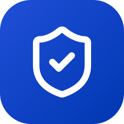
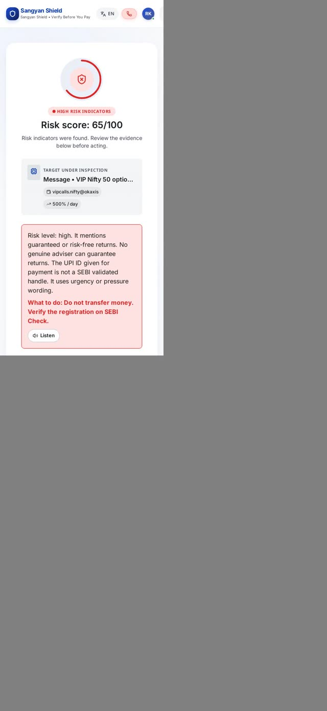
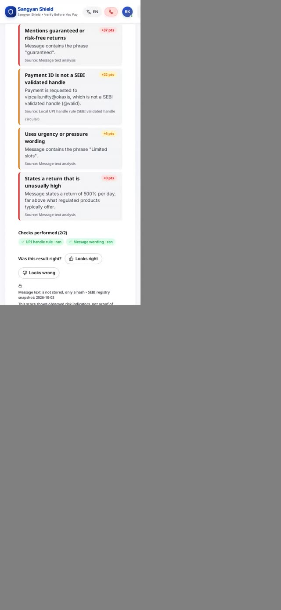
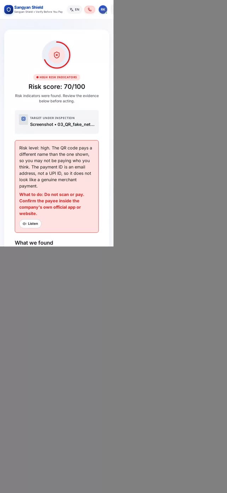
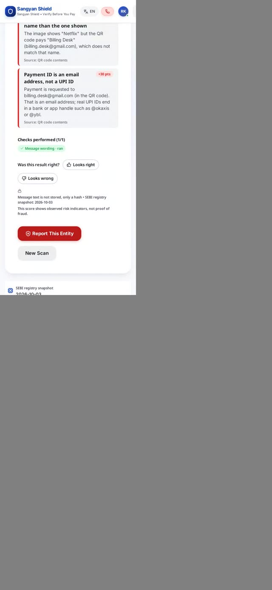
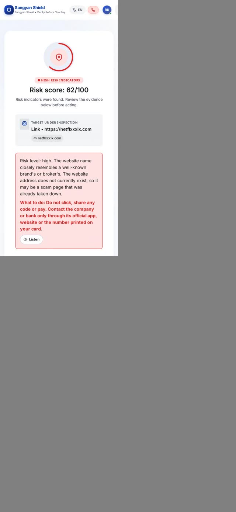
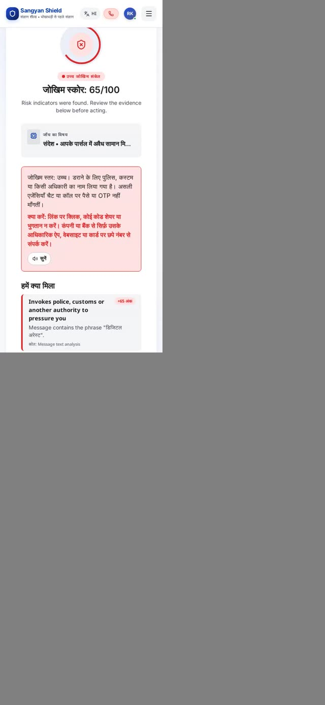

<p align="center">
  
</p>

<h1 align="center">Sangyan Shield <sub>(संज्ञान शील्ड)</sub></h1>

<p align="center"><b>Verify before you pay.</b> &nbsp;•&nbsp; धोखाधड़ी से पहले संज्ञान</p>

<p align="center">
  Paste a message, upload a screenshot or QR, or drop a link. Get a risk score and the evidence behind every point, in English or Hindi.
</p>

---

## Contents

1. [Product name](#1-product-name)
2. [What it does](#2-what-it-does)
3. [Target audience](#3-target-audience)
4. [Main USP](#4-main-usp)
5. [Logo](#5-logo)
6. [Brand colors](#6-brand-colors)
7. [Website and screenshots](#7-website-and-screenshots)
8. [Key features](#8-key-features)
9. [How it works](#9-how-it-works)
10. [Run it locally](#10-run-it-locally)
11. [API](#11-api)
12. [Tech stack](#12-tech-stack)
13. [Testing and accuracy](#13-testing-and-accuracy)
14. [Known limitations](#14-known-limitations)
15. [Project structure](#15-project-structure)

---

## 1. Product name

**Sangyan Shield** (संज्ञान शील्ड)

- *Sangyan* (संज्ञान) means "awareness / cognizance": knowing what is in front of you before you act on it.
- **Tagline:** *Verify before you pay.*
- **Hindi tagline:** *धोखाधड़ी से पहले संज्ञान*

## 2. What it does

Sangyan Shield is a scam-detection tool for India. You give it something suspicious and it tells you how risky it looks, with the reasons.

| You give it | It does |
|---|---|
| **A message** (SMS, WhatsApp, Telegram text) | Looks for scam wording, unrealistic return claims, SEBI registration claims, payment IDs and links |
| **A screenshot or QR image** | Reads the text (OCR, English and Hindi), **decodes the QR code**, and checks who the QR really pays versus who the poster says it is |
| **A link** | Checks for lookalike brand addresses, phishing lists, domain age and shortened or risky addresses |
| **A voice note** | Transcribes it (Sarvam speech-to-text) and runs the same checks |

The result is a **0–100 risk score**, a band (Low / Medium / High / Critical), the list of evidence with the points each item added, a plain-language explanation, and a safe next step. Results can be read aloud (Sarvam text-to-speech).

> It shows **observed risk indicators, not proof of fraud.** It never says a message is "safe". A Low score means nothing risky was found by the checks that ran.

## 3. Target audience

- **Everyday UPI and mobile-banking users in India**, especially people who receive forwarded WhatsApp, Telegram and SMS offers and are unsure what to trust.
- **First-time and retail investors** who get stock-tip groups, "guaranteed return" pitches and advisers claiming SEBI registration.
- **Families and older relatives** who are targets of "digital arrest", KYC-expiry, lottery and fake-customer-care scams.
- **Hindi-first users**: the whole interface and the explanations are available in Hindi.
- **Shopkeepers and people scanning QR stickers** who want to know whether a QR pays the name printed on it.

## 4. Main USP

**Every score is explained, and the score comes from rules, not from an AI's opinion.**

1. **Rules decide, the AI only words it.** The language model extracts claims and writes the explanation. It never sets the score. The same input always gives the same score.
2. **Every point is traceable.** Each risk signal shows its source and how many points it added. The points add up to the score. Nothing is a black box.
3. **Checks against real data**, not guesses: the SEBI intermediary registry (9,838 records), OpenPhish and URLhaus feeds, live domain-age lookups (RDAP) and a list of well-known brand domains.
4. **It catches what looks fine to the eye.** For example, a poster that says "Netflix" but whose QR pays a stranger's email address, which is the kind of scam that image-only or text-only tools miss.
5. **Honest about gaps.** If a check cannot run (for example a service is down), it is shown as *unavailable* and never counted as reassurance.

## 5. Logo

<p align="center">
  
</p>

A white **shield with a check mark** on a rounded blue square: protection plus verification.

- File: [`docs/logo.svg`](docs/logo.svg) (vector, 256×256)
- Gradient: `#1f4fd8` → `#0037b1`, corner radius 25% of the size
- Wordmark: "Sangyan Shield" set in **Inter**, weight 800, tight letter-spacing (−3%)

## 6. Brand colors

These are the design tokens used by the app (`frontend/src/index.css`).

| Role | Swatch | Hex |
|---|---|---|
| **Primary** (buttons, links, logo) |  | `#0037b1` |
| **Primary container** (logo gradient start, accents) |  | `#1f4fd8` |
| **Primary fixed** (soft highlights) |  | `#dce1ff` |
| **Secondary** |  | `#4e5b93` |
| **Risk / error** (High and Critical) |  | `#ba1a1a` |
| **Safe / success** |  | `#005120` |
| **Surface** (page background) |  | `#f7f9fb` |
| **On-surface** (text) |  | `#191c1e` |

**Typography:** Inter (Latin) and Noto Sans Devanagari (Hindi).

**Launch video palette:** ink `#060b1e`, glow blue `#2f6bff` / `#8fb0ff`, alert red `#ef4444`.

## 7. Website and screenshots

**Live demo:** the app runs locally (see [Run it locally](#10-run-it-locally)). `run_all.sh` can also open a temporary public link with ngrok so others can test it. The link changes each run.

> The original UI came from [Kushalsharma0702/Sangyaan](https://github.com/Kushalsharma0702/Sangyaan). This repository connects it to the real backend.

All screenshots below are real results from the running app, on a phone-sized screen.

| Message scan | Evidence breakdown | QR screenshot |
|:--:|:--:|:--:|
|  |  |  |
| Scam message → **65/100, High** | Every point is listed with its source | Fake Netflix QR → **70/100, High** |

| QR evidence | Fake link | Hindi |
|:--:|:--:|:--:|
|  |  |  |
| Poster says Netflix, QR pays a stranger's email | `netflxxxix.com` → **62/100, High** | Same checks in Hindi |

**Launch video:** [`brag-output/brag.mp4`](brag-output/brag.mp4) (28 s, vertical, 3D motion edit built from recordings of the real app).

## 8. Key features

### Four ways to check
- **Message:** paste any text.
- **Screenshot:** upload an image. OCR reads English and Hindi, and the QR code is decoded.
- **Link:** paste a URL or domain.
- **Voice:** record or upload audio; it is transcribed, then checked.

### What it detects
| Category | Examples |
|---|---|
| **Investment fraud** | Guaranteed or unrealistic returns (for example 30% per month), SEBI registration that does not exist, belongs to someone else, or is quoted with no number |
| **Impersonation** | "CBI / police / customs", "digital arrest", fake customer care, fake brand and bank domains |
| **Payment tricks** | Payee is an email address instead of a UPI ID, QR pays a different name than the poster, "I sent money by mistake, return it", "I lost my phone, send money" |
| **Credential theft** | OTP, PIN, card or Aadhaar and bank-detail requests; login pages on lookalike domains |
| **Lures and pressure** | Lottery and prize wins, advance "fees" to release a loan or parcel, part-time task jobs, "your account will be blocked today" |
| **Technical red flags** | Remote-access apps (AnyDesk and similar), APK downloads, shortened links, throwaway address endings, brand-new or unregistered domains, phishing-feed hits |

### Built to avoid false alarms
- Warnings, news and awareness text ("never share your OTP", "police arrested a gang…") are not flagged as scams.
- Real delivery OTPs, bank debit alerts, bills and official domains stay Low.
- Negation only applies inside the same sentence clause.
- Genuine logos on a payment sticker (G Pay, PhonePe, Amazon Pay) are not mistaken for the shop's brand.

### Transparency
- Evidence cards with **points added** per signal; points sum to the score.
- Coverage panel: "Checks performed 5/6" with each check marked *ran* or *unavailable*.
- A "safe next step" tailored to the finding (payment, investment or generic).
- Message text is **not stored**: only a hash is kept.

### Language and accessibility
- Full **English and Hindi** interface and explanations.
- Text-to-speech for results (Sarvam `bulbul:v3`).
- Mobile-first, responsive layout.

### Reporting and help
- One-tap links to the **1930** National Cyber Crime Helpline and cybercrime.gov.in.
- "Report this entity" and feedback ("Looks right / Looks wrong") on every result.
- Local scan history.

## 9. How it works

```
 input ──► extract ──► verify ──► detect ──► score ──► explain
(text/URL/  OCR, QR    registry,   scam      rules,    LLM words it
 image/     decode,    feeds,      phrases,  fixed     in EN / HI
 audio)     STT        domain age  claims    weights
```

1. **Extract:** OCR (Tesseract, English + Hindi), QR decoding (OpenCV), speech-to-text (Sarvam), then the LLM pulls out names, SEBI numbers, URLs, UPI IDs and return claims.
2. **Verify:** SEBI registry lookup, OpenPhish and URLhaus lists, brand lookalike check, RDAP domain age (an unregistered domain counts as such only when DNS also fails), payment ID and QR payee checks, optional Google Safe Browsing.
3. **Detect:** phrase rules in `backend/app/data/scam_patterns.yaml` for scam wording, with negation and awareness-text handling.
4. **Score:** each risk category counts once, at its worst severity.

   | Category | Max points |
   |---|---|
   | SEBI | 25 |
   | Entity | 20 |
   | Returns | 15 |
   | Payment | 15 |
   | Domain | 10 |
   | Urgency | 10 |
   | Technical | 5 |

   Strong single signals (a phishing-feed hit, remote-access request, OTP request, lookalike domain…) and combinations (for example fake registration + too-good return) raise the score to a minimum floor. **Bands:** Low ≤ 30, Medium ≤ 60, High ≤ 80, Critical > 80.
5. **Explain:** the LLM (Gemini) writes the summary in English or Hindi from the evidence. If it is unavailable, built-in templates are used, so a result is always produced.

## 10. Run it locally

**Requirements:** Docker, Python 3.10+, Node 18+, Tesseract (with `eng` and `hin` data). `ngrok` is optional, for sharing.

```bash
# 1. configure keys (never commit this file)
cp backend/.env.example backend/.env   # then fill in the values below

# 2. start database, backend, frontend (and a public tunnel)
./run_all.sh            # add --local to skip ngrok;  --stop to shut everything down
```

`backend/.env` values:

| Variable | Used for |
|---|---|
| `DATABASE_URL` | Postgres connection |
| `LLM_BASE_URL`, `LLM_API_KEY`, `LLM_MODEL` | Explanations (Gemini via its OpenAI-compatible endpoint) |
| `SARVAM_API_KEY` | Voice transcription and read-aloud |
| `SAFE_BROWSING_KEY` | Optional Google Safe Browsing (the API must be enabled on your Google Cloud project) |

Everything except the LLM, Sarvam and Safe Browsing works without keys; the missing checks show as *unavailable*.

Local ports: frontend `5173` (proxies `/api` to the backend), backend `8000`, Postgres `54329`.

**Try it:** [`test-samples/`](test-samples/) has scam and genuine images and messages with the expected result for each.

## 11. API

Base path `/v1`. Rate-limited per IP.

| Method | Path | Purpose |
|---|---|---|
| `POST` | `/v1/analyze` | Text, URL, image or audio in; risk result out. JSON for text and URL, multipart for image and audio |
| `GET` | `/v1/scan/{scan_id}` | Fetch a stored result |
| `POST` | `/v1/page-check` | Fast check for a browser extension (no OCR, ASR or LLM) |
| `POST` | `/v1/report` | Report a suspicious entity |
| `POST` | `/v1/voice/transcribe` | Speech to text |
| `POST` | `/v1/voice/speak` | Text to speech |
| `GET` | `/healthz` | Health check |

Example:

```bash
curl -s -H 'Content-Type: application/json' \
  -d '{"input_type":"text","text":"Guaranteed 30% monthly returns. Pay 5000 to vip@okaxis","language":"en"}' \
  http://localhost:5173/api/v1/analyze
```

## 12. Tech stack

| Layer | Technology |
|---|---|
| **Frontend** | React 19, Vite, Framer Motion, Three.js (`@react-three/fiber`), Lucide icons |
| **Backend** | FastAPI, SQLAlchemy, Alembic, httpx, rapidfuzz, tldextract, slowapi |
| **Database** | PostgreSQL 16 |
| **Vision / audio** | Tesseract OCR, OpenCV (QR), Pillow, Sarvam STT (`saarika:v2.5`) and TTS (`bulbul:v3`) |
| **LLM** | Gemini 2.5 Flash through an OpenAI-compatible API |
| **Data** | SEBI registry snapshot, OpenPhish, URLhaus, curated brand-domain list |
| **Testing** | pytest (backend), Playwright (UI) |

## 13. Testing and accuracy

- **231 automated backend tests** pass, including a test that every risk code has a triggering example.
- **Independent check:** 55 genuine messages (bank alerts, OTP-in-delivery, bills, SIP confirmations, scam warnings, news, Hindi and Hinglish) and 30 differently worded scams. After tuning, **0 of 55 genuine messages scored above Low, and 30 of 30 scams scored High**.
- **Be careful with these numbers.** The test messages were written by the same people who wrote the rules, so real-world accuracy will be lower. The first run of the independent scam set caught only 10 of 30 before the rules were widened.

Run the tests:

```bash
cd backend && .venv/bin/python -m pytest -q
```

## 14. Known limitations

- Detection is **rule-based and hand-written**; new scam wordings will be missed until rules are added.
- The brand list is curated by hand and covers about 45 brands.
- Hindi rules are fewer than English ones, and Hindi strings need review by a native speaker.
- HEIC images are not supported.
- Awareness-text exemption could be abused by a scammer who adds warning words.
- Google Safe Browsing stays *unavailable* until the API is enabled in your Google Cloud project.
- The UPI `@valid` handle pattern is unconfirmed.
- The page header still contains placeholder labels from the original design ("AI Shield Engine v4.2", "100% RAM Processed") that are not real features.
- The production Docker image has not been built.
- A low score is **not** a guarantee of safety. For investments, always confirm on SEBI Check.

## 15. Project structure

```
.
├── backend/            FastAPI service: pipeline, rules, data, tests
│   └── app/
│       ├── api/        HTTP routes (analyze, voice, report, extension)
│       ├── pipeline/   extract, verify, detect, risk, explain
│       └── data/       SEBI registry, phishing feeds, brands, scam patterns
├── frontend/           React + Vite app
├── test-samples/       Scam and genuine images and text for manual testing
├── brag-output/        Launch video (brag.mp4), poster frame and share copy
├── docs/               Logo and screenshots used in this README
└── run_all.sh          Starts database, backend, frontend and optional tunnel
```

## Helplines (India)

- **National Cyber Crime Helpline:** dial **1930**
- **Report online:** [cybercrime.gov.in](https://cybercrime.gov.in)
- **Report spam and fraud calls:** [sancharsaathi.gov.in](https://sancharsaathi.gov.in)

---

<p align="center">Sangyan Shield shows risk indicators, not proof of fraud.</p>
